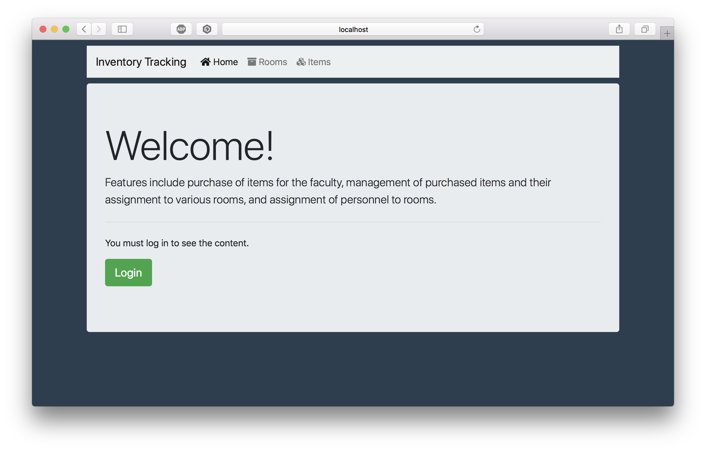
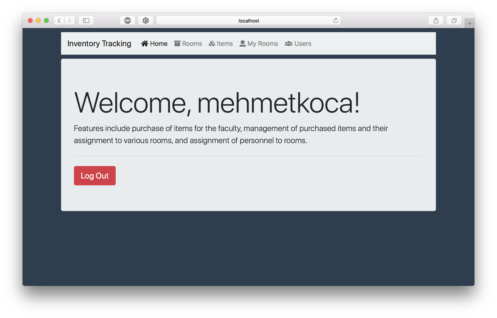
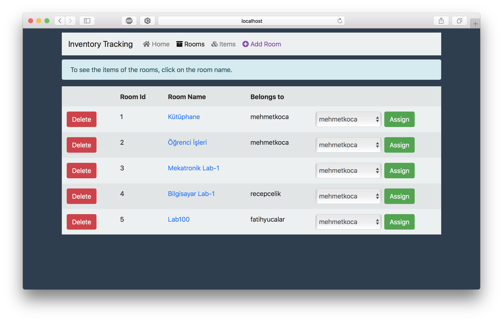

# Inventory-Tracking
Design and implemented of an inventory tracking system using Spring framework with Maven project and MySQL. Features include purchase of products for the faculty, management of purchased products and their assignment to various departments, and assignment of personnel to departments.

**Contributor**
- [Recep ÇELİK](https://github.com/Rexulon)

